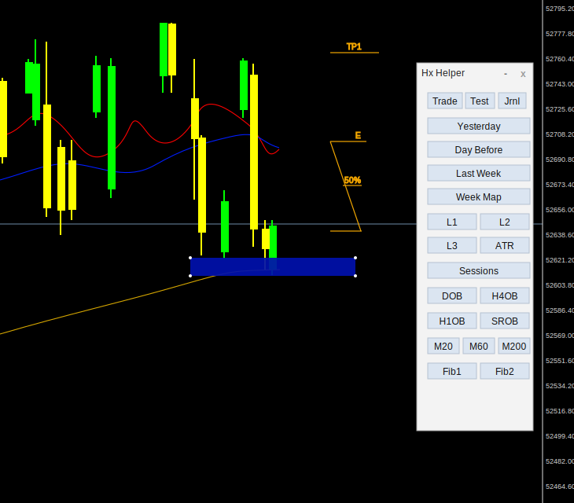
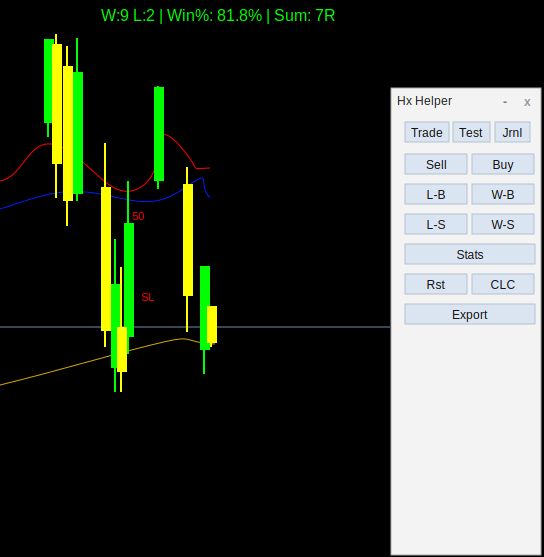
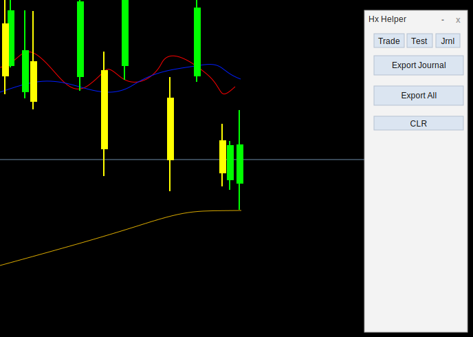

# HxTradeHelper

[](https://github.com/hamed-nasrollahi/HxTradeHelper/stargazers)
[](https://github.com/hamed-nasrollahi/HxTradeHelper/network/members)
[](LICENSE)

A MetaTrader 5 chart panel for intraday traders: reference levels and
session tools for live trading, a manual back-testing workflow with
win/lose statistics, and a one-click trade journal that exports your day's
trades with clean chart screenshots and stores them in MariaDB.

The panel is an MQL5 indicator (`hx_trade_helper.mq5`) with three tabs:

| Tab | Purpose |
|-----|---------|
| **TR** (Trade) | Chart preparation and live-trading tools |
| **TE** (Test) | Manual back-testing markers and statistics |
| **JR** (Journal) | End-of-day journal export |

The panel is a narrow, two-column layout (tool buttons are at most two per
row); the TR/TE/JR tab selectors are colored separately from the rest so
they stand out as navigation rather than tools.

## Screenshots







## Features

### Trade tab

- **Reference lines** — yesterday's open/high/low/close, the day before
  yesterday's close, last week's close, and a "week map" (last week's
  high/low with 25/50/75% levels)
- **Round-number levels** — three configurable step grids (L1/L2/L3,
  defaults tuned for XAU/USD) drawn across today's range
- **ATR bands** — yesterday's close ± daily ATR
- **Sessions** — Tokyo/London/New York vertical session lines plus
  countdown labels (open/close timers), and a candle-close countdown and
  spread display (input toggles)
- **News countdown** — optionally fetches the weekly calendar from the
  dashboard's `/api/news` (through the uploader DLL; the dashboard itself
  caches and refreshes from ForexFactory at most once an hour), keeps only
  orange/red-impact events for your currencies, and shows a corner
  countdown to the next event — switching to a LIVE remaining-time display
  while the event is in progress
- **Order blocks** — one-click rectangles for daily / H4 / H1 /
  support-resistance zones
- **Moving averages** — EMA 20/60/200 toggles
- **Fib tools** — three fib variants (dark gray, orange, gray) with
  SL/E/TP1..TP7 levels

### Test tab (manual back-testing)

- **Sell / Buy planners** — drag-adjustable trade elements showing SL/TP
  zones, pip distances and R:R live while you move them
- **W-B / L-B / W-S / L-S** — mark a win/lose buy/sell at the chart
  center; markers are fib objects you can reposition
- **Stats** — on-chart W/L count, win % and R-sum overlay
- **Export** — writes all markers to `backTest_<date>.csv` (+ JSON
  sidecar), sorted chronologically
- **Rst / CLC** — reset markers and counters, or recount from the chart

### Jrnl tab (trade journal)

One click on **Export Journal**:

1. Collects **today's trades from the account history** (closed positions
   plus still-open positions opened today) — all symbols, not just the
   current chart
2. Writes `trades_<date>.csv` and `trades_<date>.json` with symbol, type,
   win/lose result, planned R:R, entry/SL/TP/close prices, profit and
   open/close times
3. Captures **H1, M5 and M1 screenshots per trade**, scrolled to the
   trade's entry bar, on freshly opened charts with a clean black & white
   scheme — objects drawn on your working charts never appear in them
4. **POSTs the JSON to the dashboard's import endpoint**, which upserts
   into MariaDB (re-exporting is safe; open trades update once they close)

One click on **Export All** backfills the journal:

1. Collects the **entire account trade history** (every closed position
   plus currently open ones) — no screenshots, so it stays fast even for
   large histories
2. Writes `trades_all_<date>.json` to the `TradesHistory` folder
3. POSTs the JSON to the dashboard flagged `skip_existing`, so **position
   ids already in the database are left untouched** — existing rows (and
   their strategy assignments) are never overwritten; only new trades are
   inserted. The API response reports `saved` and `skipped` counts in the
   Experts log.

Output layout under `MQL5\Files`:

```
TradesHistory\
└── 2026.07.02\
    ├── trades_2026.07.02.csv
    ├── trades_2026.07.02.json
    └── XAUUSD\
        └── 09_30_987654321\
            ├── PERIOD_H1.png
            ├── PERIOD_M5.png
            └── PERIOD_M1.png
```

## Repository layout

| Path | Contents |
|------|----------|
| `hx_trade_helper.mq5` | The indicator (panel, tools, journal export) |
| `DialogHx.mqh`, `TradeElement.mqh` | Dialog subclass and the drag-adjustable trade planner element |
| `dotnet/HxTradeUploader/` | .NET 8 Native AOT library the indicator calls to POST the journal to the dashboard |
| `dotnet/schema.sql` | MariaDB setup: database, `trades` table, application user |
| `dotnet/README.md` | DLL build/install details |
| `dashboard/` | Next.js analytics dashboard: journal import endpoint, strategy tagging, statistics, equity curve, Docker deployment |
| `dashboard/README.md` | Dashboard setup details |

## Installation

### 1. Indicator

Copy `hx_trade_helper.mq5`, `DialogHx.mqh` and `TradeElement.mqh` into the
terminal's `MQL5\Indicators` folder (keep them together) and compile in
MetaEditor. Note: the `#import "HxTradeUploader.dll"` requires the DLL from
step 2 to be present in `MQL5\Libraries` before compiling.

### 2. Uploader DLL

Requires the .NET 8 SDK and the Visual Studio 2022 C++ workload (Native
AOT uses the MSVC linker):

```
cd dotnet/HxTradeUploader
dotnet publish -c Release -r win-x64
```

Copy `bin\Release\net8.0\win-x64\publish\HxTradeUploader.dll` into
`MQL5\Libraries`, then enable *Tools → Options → Expert Advisors → Allow
DLL imports* (and the same option on the indicator's Common tab when
attaching it). The DLL is self-contained — no .NET runtime needed on the
trading machine.

### 3. Database and dashboard (optional, for the MariaDB journal)

```
cd dashboard
DB_PASSWORD=<pick-a-password> docker compose up -d --build
```

This starts MariaDB (schema applied automatically) and the analytics
dashboard on <http://localhost:3000>, whose `POST /api/import` endpoint
receives the indicator's journal uploads — set the indicator's `ApiUrl`
input to `http://<dashboard-host>:3000/api/import`. See
`dashboard/README.md` for using an existing MariaDB instead. Without the
dashboard running, the journal still writes the CSV/JSON files and
screenshots locally; only the upload step is skipped (with a note in the
Experts log).

## Key inputs

| Input | Default | Meaning |
|-------|---------|---------|
| `JournalBasePath` | `TradesHistory` | Base folder for all exports/screenshots (under `MQL5\Files`) |
| `ApiUrl` | `http://127.0.0.1:3000/api/import` | Dashboard import endpoint |
| `ApiKey` | *(empty)* | Sent as `X-Api-Key` header when set |
| `UploadToApi` | `true` | POST the journal to the dashboard after export |
| `showCandleTime` / `showSessions` / `showSlipage` | `false` | Candle-close countdown, session timers, spread label (1-second timer starts only if one is enabled) |
| `ShowNews` | `false` | Fetch the calendar and show the red/orange event countdown |
| `NewsCurrencies` | *(empty)* | CSV currency filter for events; empty = the chart symbol's base and profit currencies |
| `NewsWindowMinutes` | 2 | Countdown appears when the next event is within this window |
| `NewsDurationMinutes` | 15 | How long an event stays "LIVE" after its release time |
| `NewsFeedUrl` | `https://trade.hamex.ee/api/news` | Dashboard news endpoint (`?currencies=` is appended automatically) |
| `Level1/2/3` | 1.25 / 2.50 / 5.00 | Round-number grid steps (price units) |
| `ATR_Period` | 14 | Daily ATR period for the bands |
| `SummerTime` | `false` | DST adjustment for session times |
| `tradeRisk` | 1.0 | R multiple a win counts for in the back-test stats |

Colors, line styles and widths for every drawn element are exposed as
inputs as well.

## Notes

- The indicator is multi-instance safe: attach it to several charts of
  different symbols at once; all drawn objects and the panel are
  per-chart. The journal export is account-wide regardless of which chart
  triggers it.
- The journal reads **real account trade history** (deals), so results,
  prices and times match your broker statement; R:R is computed from the
  SL/TP recorded on the deals.
- MQL5 indicators may not call `WebRequest`, which is why the upload goes
  through the native DLL instead.

## License

[CC BY-NC-SA 4.0](LICENSE) — free for personal, non-commercial use. If you
modify and redistribute the code, you must credit Hamed Nasrollahi and
keep derivatives under the same license. Commercial use requires
permission from the author.

## Stargazers over time

[](https://starchart.cc/hamed-nasrollahi/HxTradeHelper)

If this project helps your trading workflow, consider giving it a ⭐.
